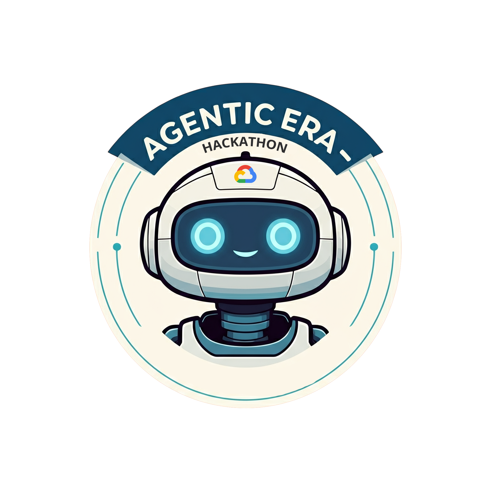

# Hi, I'm Utku Murat Atasoy

**AI/ML Engineer @Turkcell**

## About

- AI/ML Engineer with a B.Sc. in Artificial Intelligence Engineering from TOBB ETU. 

- Currently building LLM-based conversational systems at Turkcell, focusing on backend infrastructure, API optimization, and production-ready flow orchestration with LangChain, Langfuse, and FastAPI.

## Research

- **[AI-Powered Deepfake Detection in Biometric Systems](https://ieeexplore.ieee.org/document/11208454)** — IEEE ASYU 2025
  Developed a domain-independent deepfake detection pipeline for biometric security systems. Created a hybrid dataset by combining multiple manipulation sources, achieving high accuracy and strong generalization on both known and unseen data scenarios.

## Skills

**AI/ML:** Large Language Models, LangChain, Langfuse, LiteLLM, Computer Vision, Deep Learning, TensorFlow, PyTorch, scikit-learn, OpenCV

**Backend:** FastAPI, Flask, PostgreSQL, MySQL, SQLite

**Edge AI:** Model optimization, TFLite, ONNX, Raspberry Pi, Arduino

**Languages:** Python, C, C++, Java, C#, R

## Badges

  

