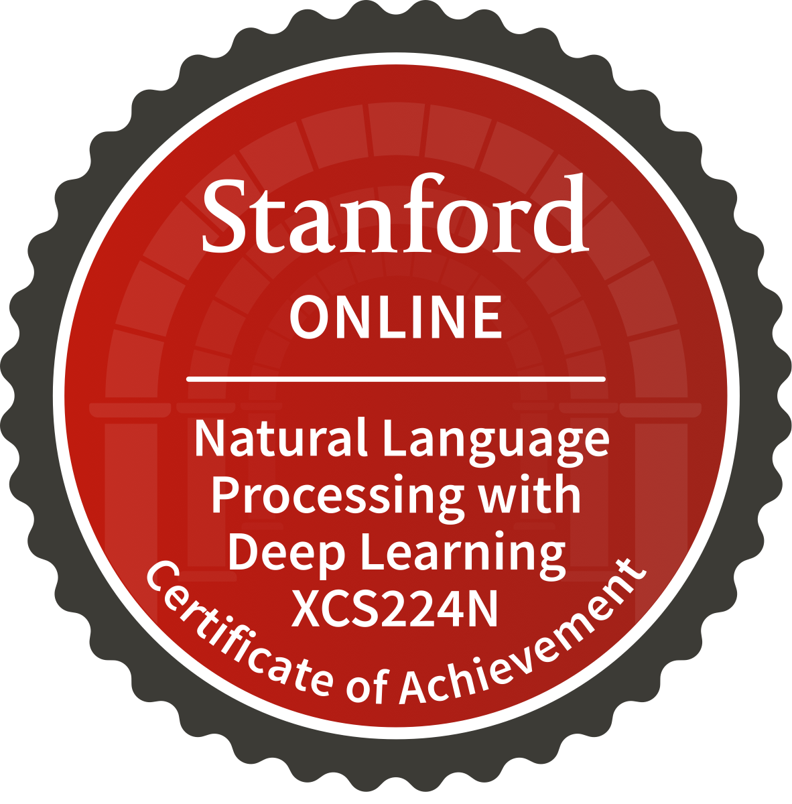
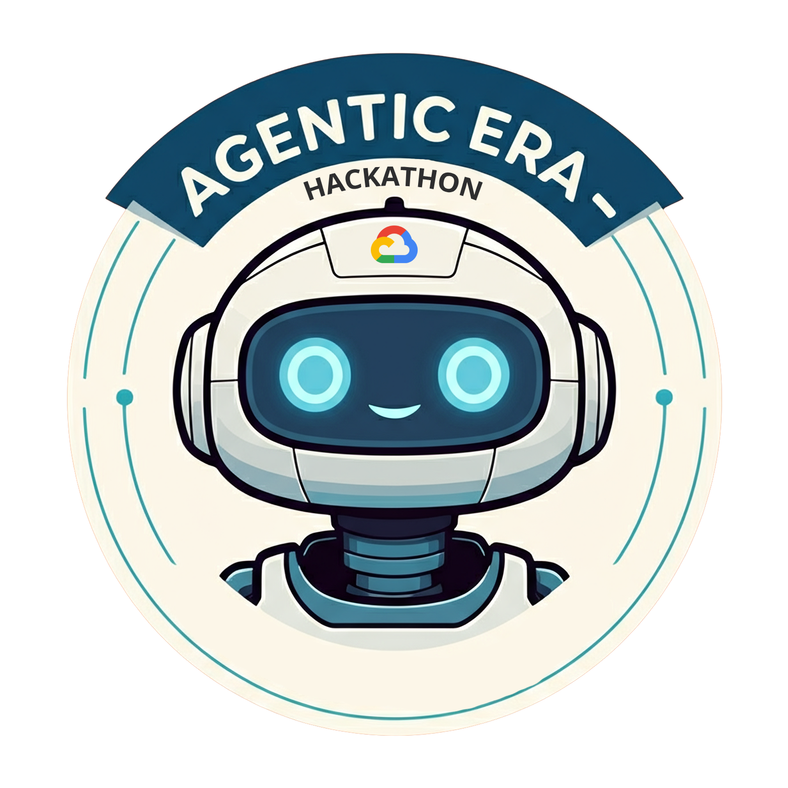
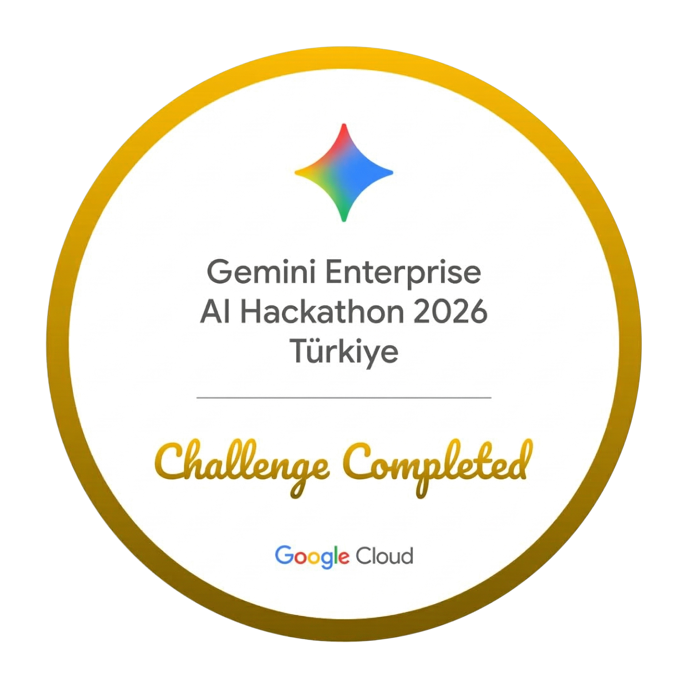

# hi, i'm utku atasoy 👋

`ai/ml engineer @ turkcell technology`

[](https://linkedin.com/in/utku-murat-atasoy)
[](https://scholar.google.com/citations?user=Rw6NL9UAAAAJ&hl=en)

## `$ cat about.py`

```python
utku = {
    "role":      "ai/ml engineer @ turkcell technology",
    "studying":  "m.sc. data science & ai @ boğaziçi university",
    "graduated": "b.sc. ai engineering @ tobb etu",
    "building":  "llm-powered ai call center backend",
    "stack":     ["langgraph", "langchain", "litellm", "langfuse", "mcp",
                  "whisper", "faiss", "fastapi", "postgresql", "redis",
                  "opensearch", "openshift", "jenkins"],
    "research":  "deepfake detection in biometric systems @ ieee asyu 2025",
    "fuel":      ["sleep", "caffeine", "l-citrulline"],
}
```

## `$ cat research.md`

- **[AI-Powered Deepfake Detection in Biometric Systems](https://ieeexplore.ieee.org/document/11208454)**
  built a domain-independent deepfake detection pipeline for biometric security systems. combined multiple manipulation sources into a hybrid dataset, reaching high accuracy and strong generalization on both known and unseen data.

## `$ cat skills.yaml`

```yaml
ai_ml:     [llms, langgraph, langchain, langfuse, litellm, google-adk, mcp, whisper, faiss,
            computer-vision, yolo, deep-learning, tensorflow, pytorch, scikit-learn, opencv]
backend:   [fastapi, flask, sqlalchemy, postgresql, redis, opensearch, mysql, sqlite]
devops:    [openshift, kubernetes, docker, jenkins-ci/cd]
cloud:     [gcp, vertex-ai, cloud-run]
edge_ai:   [model-optimization, tflite, onnx, raspberry-pi, arduino]
languages: [python, c, c++, java, c#, r]
```

## `$ ls ./badges`

<p align="center">
  <a href="https://digitalcredential.stanford.edu/check/9BB14D74156B44E258AFB47165EB5A521406AF4D089D597C4D04ACE53DE5DA6DZThUNGF2Mk9PK2I3UEtvalRyTS9jVlVWcVZoRnA2Z09ML0tpb3JvVS8xNFluUzFq"></a>
  <a href="https://www.credly.com/badges/25b654cc-24a3-46b7-a7ac-47ac04721a27"></a>
  <a href="https://www.credly.com/badges/51b8b130-3b44-4b5d-9664-b34a4500a760"></a>
</p>
